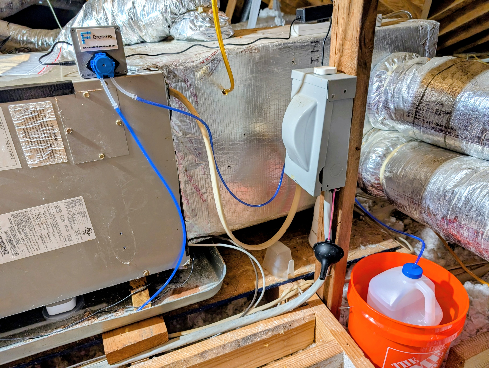

# DrainFlo

A local, cloud free automatic vinegar doser for an HVAC condensate drain line.

Once a month it pumps one cup of distilled white vinegar into the drain line cleanout, then tells you it worked. No subscription, no cloud account, no app. Everything runs in Home Assistant on your own network.

It replaces the monthly chore of climbing into the attic with a measuring cup.

**Total build cost: roughly $110 in parts plus about 60 g of filament**, buying everything new. Less if you already have a 12V supply, hookup wire and a leak sensor, which many people will. See the [bill of materials](docs/02-bill-of-materials.md) for the breakdown.

---


*The finished install. Enclosure on the air handler, vinegar jug in its containment bucket, tubing run to the drain line cleanout.*

---
## Why I built this

Commercial automatic drain line dosers exist. The one that prompted this project is cloud dependent and uses proprietary cartridges of its own cleaning fluid, which means an account you have to keep, a service that has to stay running, and a consumable you can only buy from one place at a price they set.

None of that is necessary to squirt a cup of vinegar down a pipe once a month.

DrainFlo runs entirely on your own network. There is no account, no app, no telemetry and nothing to subscribe to. The consumable is a gallon of distilled white vinegar from the grocery store, and a gallon lasts about 16 months. If the company that made your relay disappears tomorrow, the system keeps working, because nothing in it phones home.

That principle is worth more than the money. A cloud product is only as permanent as its vendor's business model, and hardware bolted to your house should outlive that.

---

## What it does

- Doses one cup of vinegar at 05:00 on the 15th of every month
- Confirms the pump actually ran, and tells you when it did not
- Tracks how much vinegar is left in the jug and warns you before it runs out
- Force stops the pump if it ever runs longer than it should
- Runs entirely locally over Zigbee or WiFi

## What it is not

This is not a certified product. It is a pump moving liquid above your ceiling, and the thing preventing an overflow is software you are choosing to trust. **Read [docs/08-safety.md](docs/08-safety.md) before you build it.** Containment and a leak sensor are requirements, not suggestions.

---

## Documentation

| Document | Contents |
|---|---|
| [01 Overview](docs/01-overview.md) | How the system works and why it is designed this way |
| [02 Bill of materials](docs/02-bill-of-materials.md) | Every part, with sizes and substitution notes |
| [03 Enclosure](docs/03-enclosure.md) | Printing and assembling the box, lid and badge |
| [04 Plumbing](docs/04-plumbing.md) | The cleanout cap, tubing, jug and containment |
| [05 Wiring](docs/05-wiring.md) | Six connections, with the terminal map |
| [06 Home Assistant](docs/06-home-assistant.md) | Installing the package, pairing the relay |
| [07 Calibration](docs/07-calibration.md) | Measuring your pump's actual flow rate |
| [08 Safety](docs/08-safety.md) | Failure modes and what protects against each |
| [09 Troubleshooting](docs/09-troubleshooting.md) | Known issues, including the Zigbee timer problem |
| [10 ESPHome](docs/10-esphome.md) | Alternative controller with a hardware enforced runtime limit |
| [11 Shelly setup](docs/11-shelly-setup.md) | Device side setup and the three settings that protect you |

## Repository layout

```
cad/              STEP and STL files for the enclosure, lid and badge
docs/             Build documentation
esphome/          Alternative ESP32 controller: shareable project + personal config
homeassistant/    Drop in package: helpers, scripts, automations
images/           Photos, diagrams and the logo
```

---

## Printed parts

| Part | Download | Print time |
|---|---|---|
| Enclosure box | [STEP](cad/Vinegar_Doser_Box_80x80x53.step) / [STL](cad/Vinegar_Doser_Box_80x80x53.stl) | ~2 h |
| Lid with pump mount | [STEP](cad/Vinegar_Doser_Lid_pump_mount.step) / [STL](cad/Vinegar_Doser_Lid_pump_mount.stl) | ~40 min |
| DrainFlo badge, optional | [STEP](cad/DrainFlo_Badge_drop_A_full_tagline.step) | ~25 min |

About 60 g of filament all in. Print settings and orientation in [03 Enclosure](docs/03-enclosure.md).

---
## A finding worth knowing before you start

**The Shelly 1 Gen4 exposes no auto off timer when running in Zigbee mode.** The Zigbee `on_time` attribute is silently ignored: send it and the relay turns on and stays on. This is not documented by Shelly and it is the single most important thing to understand about this build, because it means the off command depends entirely on Home Assistant being alive.

DrainFlo compensates with three independent software cutoffs plus physical containment. Full detail in [docs/08-safety.md](docs/08-safety.md) and [docs/09-troubleshooting.md](docs/09-troubleshooting.md).

If you want a device side watchdog, either run the relay on WiFi instead of Zigbee, where the Shelly web interface exposes a real auto off, or use the [ESPHome controller](docs/10-esphome.md), which enforces its own maximum runtime on the microcontroller with no network involved.

---

## License

MIT. See [LICENSE](LICENSE).

## Disclaimer

DrainFlo is an independent, non commercial, open source project. It is not affiliated with, endorsed by, sponsored by, or connected to any commercial product, company or brand. Any similarity between this project's name and any trademark is unintentional and no association is implied.

Nothing is sold here and no money changes hands. The repository contains documentation and design files, published freely for anyone who wants to build their own.

## Use of AI

Portions of this project were developed utilizing AI assistance. The concept, design, physical build and all testing are mine, and all measurements in these docs came off my own bench.
