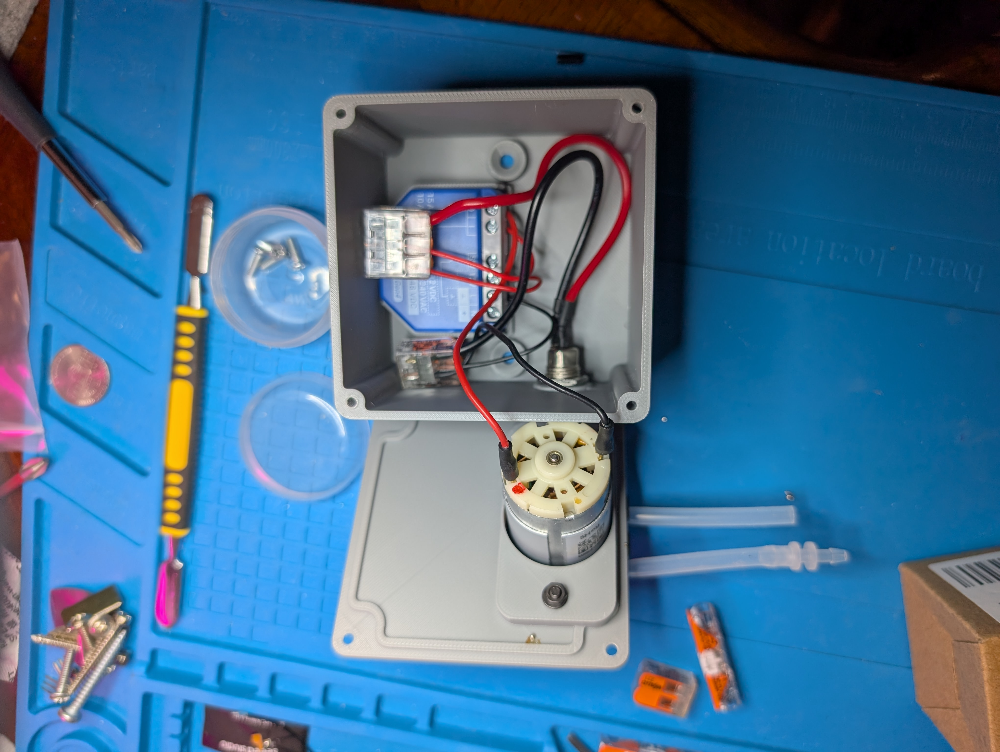
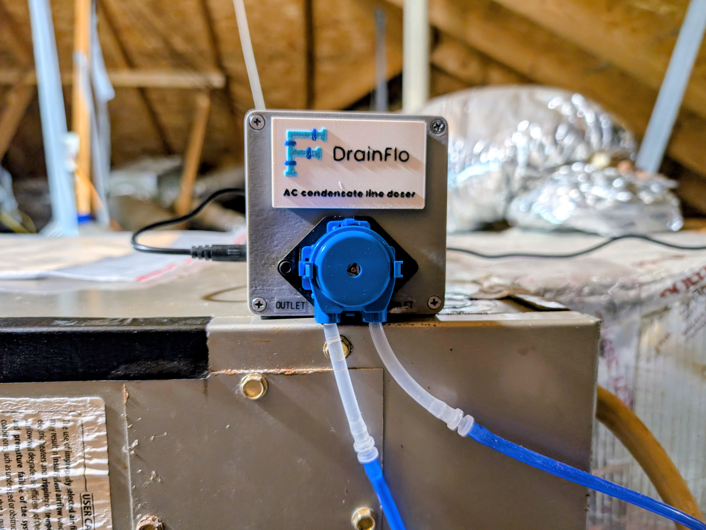

# 03 Enclosure

Three printed parts. The box holds the relay, the lid carries the pump, and the badge is decorative.

## Files

| Part | Download | What it is |
|---|---|---|
| Box | [STEP](../cad/Vinegar_Doser_Box_80x80x53.step) / [STL](../cad/Vinegar_Doser_Box_80x80x53.stl) | 80 x 80 x 53 mm box with relay pocket and barrel jack hole |
| Lid | [STEP](../cad/Vinegar_Doser_Lid_pump_mount.step) / [STL](../cad/Vinegar_Doser_Lid_pump_mount.stl) | Lid with 31 mm pump bore, reinforcing boss and M3 slots |
| Badge | [STEP](../cad/DrainFlo_Badge_drop_A_full_tagline.step) | Optional four color badge, 60 x 34 x 2.1 mm. STEP only, see the Badge section |

STEP files are provided so you can modify dimensions. STL files are provided for printing directly.

## Print settings

Developed on a Bambu Lab P2S with a 0.4 mm nozzle.

| Setting | Value | Why |
|---|---|---|
| Layer height | 0.20 mm | |
| Wall loops | 4 | The lid boss carries a cantilevered motor |
| Infill | 30% | |
| Supports | None | Both parts are self supporting in the orientations below |
| Material | PLA or PETG | PETG if your attic runs above roughly 55C |

**Orientation matters.** The box prints opening upward, floor on the plate. The lid prints flat face down with the reinforcing boss pointing up. Printing the lid the other way up needs supports under the entire boss overhang.

## Box features

- **Relay pocket**, 42.05 mm between the internal rails. A Shelly 1 Gen4 is 42.0 mm wide, so this is a press fit with essentially no clearance. If yours will not seat, file the inner faces of the two rails. They only locate the relay and carry no load.
- **11 mm hole** in one wall for the panel mount barrel jack, with an 18 mm reinforcing boss on the inside so the jack's nut has a flat seat and something to torque against.
- **Four corner posts** with 2.8 mm pilot holes, 7 mm deep from the rim.

## Lid features

- **31 mm bore** offset from center, positioned so the motor hangs beside the relay rather than above it. The relay's height therefore does not constrain the design.
- **6 mm reinforcing boss** on the inner face, bringing material under the pump flange to 8 mm total.
- **Two M3 slots** elongated along the bore's long axis, covering flange screw pitches from about 46 to 49 mm.

## Assembly

1. **Test fit the relay** in the box pocket before anything else. File the rails if tight.
2. **Fit the barrel jack** through the 11 mm hole. Gasket outside, nut inside against the boss. Hand tight plus a little.
3. **Mount the pump to the lid.** Flange on the outside of the lid, motor hanging through the bore. M3 x 16 screws down through the flange, washers and nuts on the inside of the boss. **Do this with the lid off the box**, flat on a bench. Reaching inside a 53 mm box with two wrenches is miserable.
4. **Wire it** per [05 Wiring](05-wiring.md), still with the lid off.
5. **Close the lid** with four M3 x 10 screws into the corner posts. Do not exceed 10 mm: past that the screw leaves the pilot hole and enters the hollow post, where it grips nothing and can split it.

*Pump mounted to the lid before the lid goes on the box. Flange outside, motor hanging through the bore. Do this on a bench, not reaching into a 53 mm box.*

*The finished enclosure. Badge above the pump bore, INLET and OUTLET labelled on the lid.*
## Badge

Optional. Four colors in a single 0.6 mm raised layer band, so a multi material system purges once rather than per feature.

The STEP file imports as one object with four named bodies. Assign a filament to each: base black, pipe light blue, joints dark blue, text white.

Print four at once. Purge waste is charged per color change per layer, not per object, so spares are nearly free.

Attach with VHB or double sided foam tape to the lid's outer face, above the pump bore. Clearances are tight, roughly 2 mm to the bore and 2.6 mm to the nearest corner screw recess, so do not scale it up.
