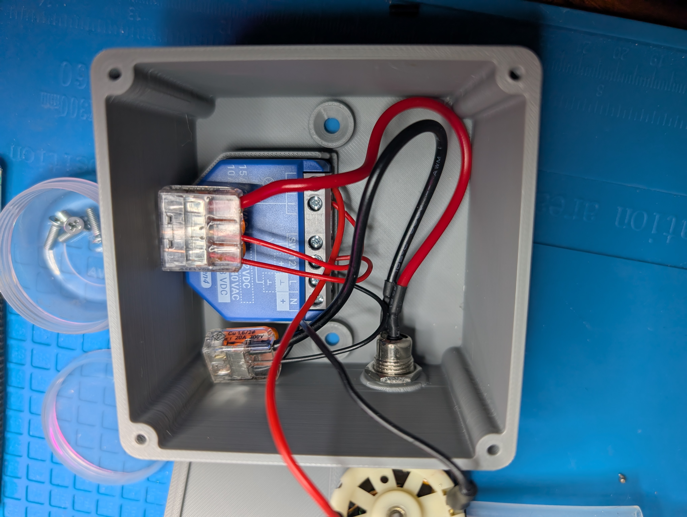
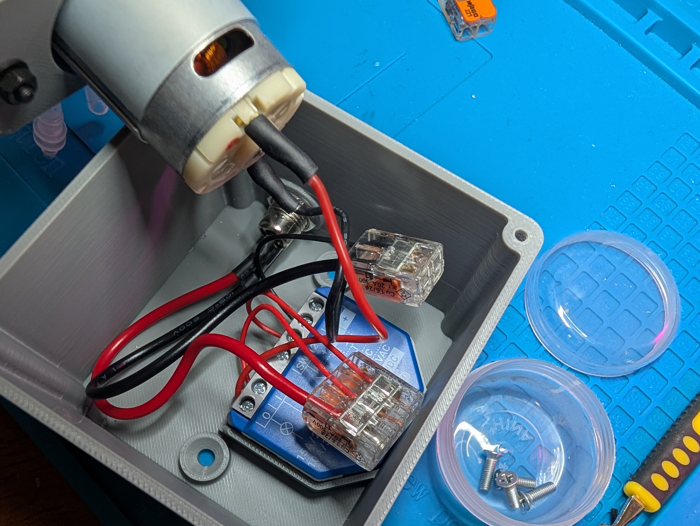

# 05 Wiring

Everything runs on 12V DC. Six connections total.

## Terminal map

The Shelly 1 Gen4 has six terminals: **O, I, SW, 12V, L, N**.

| From | To |
|---|---|
| Barrel jack **+** | Shelly **12V** |
| Barrel jack **+** | Shelly **I** |
| Barrel jack **−** | Shelly **L** |
| Barrel jack **−** | Pump lead 1 |
| Shelly **O** | Pump lead 2 |

**SW and N stay empty.**

## Why those terminals

`12V` and `L` power the relay. On the Shelly 1 Gen4, **L is the DC negative** for both of its DC modes; the positive goes to the `12V` terminal for a 12V supply, or to `N` for 24 to 48V. The legend printed on the device shows this, and the guide in the box has a dedicated figure for a stabilised 12V supply.

**Verify this against the printed guide that came with your unit before applying power.** Reversing it is the one mistake that destroys the device.

`I` and `O` are the two sides of the dry contact, which is just an isolated switch. Feeding `I` from the positive rail means the pump only sees voltage when the relay closes. The relay itself stays powered throughout.

*Looking into the box: relay in its pocket, the two lever nut junction points, barrel jack threaded through the wall.*

*All six connections made, lid still off. Wire it flat on a bench like this.*
## Junction points

The positive rail splits two ways and the negative rail splits two ways, so you need two junction points. WAGO lever nuts or a small terminal block. Do not try to force two wires under one Shelly screw terminal.

## Pump polarity

There is none that matters. A brushed DC motor reverses direction when you swap the leads, and a peristaltic pump works either way. If it pumps the wrong direction, swap them.

## Before you power up

**Meter the barrel jack.** Centre positive is the convention, not a guarantee. Plug in the supply, probe centre against sleeve, confirm you read +12 and not −12.

**Meter the supply itself, unloaded.** It should read close to 12.0 V. Older unregulated wall warts can sit at 16 to 18 V with no load, which lands between the Shelly's 12V and 24 to 48V input ranges. Any modern switching supply will be flat at 12 V.

## Assembly order

Wire everything with the lid off and the box on a bench. Once the lid is screwed down, the box is 53 mm deep and the pump is in the way.
